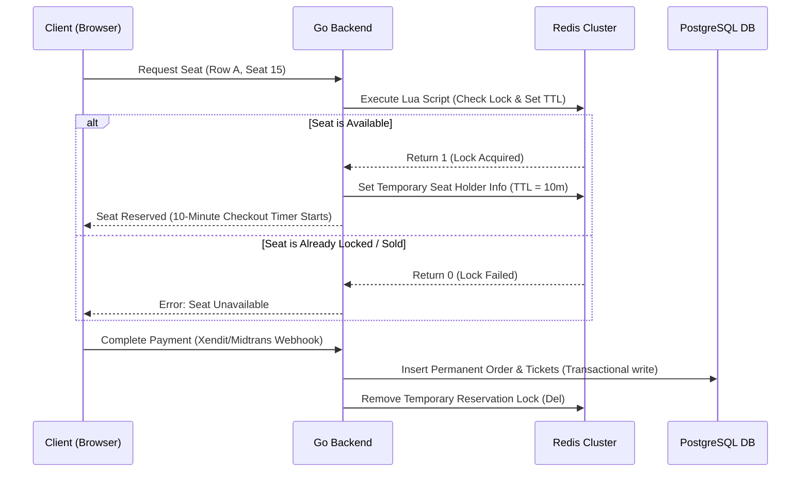

# 02. Code Security and Scalability

This document details the mathematical, cryptographic, and performance protocols that protect inventory and money transactions in CrowdFlow.

---

## 🔑 Cryptographic Standards

### 1. Offline Ticket Verification (Dynamic QR Codes)
* **Encryption Scheme**: Asymmetric ECDSA (using curve NIST P-256) or Ed25519 signing.
* **Mechanism**: To support check-in gates with poor network connectivity, QR codes encode ticket payloads signed by a private KMS key:
  $$\text{QR Payload} = \text{TicketID} \parallel \text{EventID} \parallel \text{Timestamp} \parallel \text{Signature}$$
* **Verification**: Scanning apps pre-cache the public key of the event, enabling $O(1)$ signature verification offline. Replay attacks are mitigated by requiring timestamps within current gate thresholds.

### 2. Credentials Storage
* **Hashing Standard**: Bcrypt with a work factor of $12$ for password hashes.
* **Tokens & Resets**: Secure random byte sequences (32 bytes) hashed via SHA-256 before storage in the database.

---

## ⚡ High-Concurrency Seating Reservation & Locks

CrowdFlow uses a hybrid memory-first reservation strategy. Before any database writes are initiated, seat availability is locked and verified inside Redis to prevent double booking.

### Redis Seating Locks Architecture



### 1. General Admission (GA) Tiering
* GA tiers do not have coordinates. Exclusivity is governed by atomic counters:
  ```redis
  # Checks capacity and decrements atomic capacity in one transaction
  WATCH event:ticket_tier:capacity
  GET event:ticket_tier:capacity
  MULTI
  DECRBY event:ticket_tier:capacity {qty}
  EXEC
  ```

### 2. Assigned Seating Tiering
* Uses exact coordinate strings (e.g. `event:{id}:seat:{row}:{number}`).
* Exclusivity locks are acquired via atomic `SETNX` commands with a 10-minute TTL:
  ```go
  // Acquired via Go Redis Driver
  ok, err := rdb.SetNX(ctx, "lock:event:123:seat:A:15", "user_456", 10 * time.Minute).Result()
  ```

### 3. Verification & Transaction Hook Order
> [!IMPORTANT]
> **Strict Database Transaction Separation**
> * No ticket or order record is committed to PostgreSQL during the temporary seat hold.
> * Database writes and ticket issuing ONLY occur once the webhook from Xendit/Midtrans returns a status of `paid`/`settlement`. If payment fails or the 10-minute TTL expires, the Redis key is deleted, and the seat is immediately freed.

---

## 📈 Data Integrity & Numeric Precision Standards

### 1. Anti-Enumeration Identifiers
* All public keys, URLs, and external API identifiers (orders, tickets, transactions) MUST use **UUID v4**. Auto-incrementing integer IDs (`BIGINT SERIAL`) are restricted to internal database foreign key joins.

### 2. Numeric Precision (Indonesian Rupiah - IDR)
To eliminate floating-point rounding errors and ensure perfect compliance with local tax offices:
* **Currency Values**: Enforced via `NUMERIC(12,2)`. Holds up to 10 billion IDR with fractional precision.
* **Tax and Fee Rates**: Enforced via `NUMERIC(5,2)` (e.g., standard `11.00` for PPN tax).

### 3. Financial Settlement Equation
For every transaction, the Go backend enforces strict balance matches before confirming payment:

$$\text{Gross Amount} = \text{Ticket Value} + \text{Platform Fee} + \text{Platform PPN} + \text{Gateway Fee} + \text{Gateway PPN} + \text{Entertainment Tax}$$

Where:
* $\text{Platform PPN} = \text{Platform Fee} \times 0.11$
* $\text{Gateway PPN} = \text{Gateway Fee} \times 0.11$
* $\text{Entertainment Tax} = \text{Ticket Value} \times \text{Regional Tax Rate}$

---

## 🚀 Future Development: Real-Time Platform Role Revocation (Redis Blacklist)

To ensure stateless JWT platform roles can be revoked instantly mid-session without querying PostgreSQL on every HTTP request:

### 1. Token Blacklist Architecture
* **Trigger**: When a user's global platform role is edited/revoked, the admin service pushes the user's ID to Redis with a TTL matching the remaining lifetime of the current JWT:
  ```redis
  SETEX blacklist:user:{userID} {ttl} "revoked"
  ```
* **Verification**: The `Authenticate` middleware queries Redis in $O(1)$ time:
  ```go
  exists, err := rdb.Exists(ctx, fmt.Sprintf("blacklist:user:%s", claims.UserID)).Result()
  ```
  If the key exists in Redis, the middleware intercepts the request, invalidates the cookie session, and responds with `401 Unauthorized`.

---

## 🔒 Privilege Escalation & Impersonation Prevention (BOLA Protection)

To prevent Event Organizers from creating events on behalf of other organizers (impersonation / Broken Object Level Authorization):

### 1. Context-Bound Event Creation
* **Requirement**: The `POST /api/events` handler must enforce session binding for the organizer entity.
* **Mechanism**:
  1. Retrieve the authenticated user's ID (`claims.UserID`) and roles from the JWT context claims.
  2. If the caller does **not** carry the `Super Admin` role, the backend automatically overrides the incoming `"organizer_id"` field in the JSON request with the caller's verified user ID from the claims context.
  3. If the caller is a `Super Admin`, they are permitted to specify a different `organizer_id` to allow admin-managed event creation on behalf of third-party organizer accounts.
