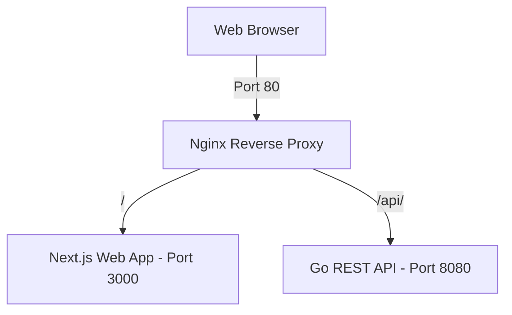

# CrowdFlow — Event Ticketing & Venue Management Platform

Welcome to **CrowdFlow**, a scalable, high-performance event ticketing and venue management system. 

This repository is structured as a monorepo containing a high-concurrency Go backend API, a modern Next.js frontend web app, and an Nginx reverse proxy routing gateway.

---

## Architecture Overview



* **Frontend:** Next.js application configured for standalone Docker optimization (Node.js 20-alpine).
* **Backend:** REST API built in Go (1.26+) utilizing standard routing mechanisms, built for fast concurrency execution.
* **Nginx Reverse Proxy:** Serves as the primary entry point, routing requests dynamically to frontend or backend services while maintaining same-origin integrity (bypassing the need for complex CORS configurations).

---

## Prerequisites

Before running the application, make sure you have the following installed on your machine:

1. **Docker & Docker Compose** (highly recommended for uniform local environment testing)
2. **Go (v1.26.2 or later)** (for local backend development)
3. **Node.js (v20 or later) & npm** (for local frontend development)

---

## Quick Start (Using Docker Compose)

`docker-compose.yml` alone is **pull-only** — it's written to serve the real
VPS deployments, which never build from source (see
[docs/operations/deployment.md](docs/operations/deployment.md)). It resolves
to `image: ghcr.io/<owner>/crowdflow-{backend,frontend,nginx}:<tag>` for all
three services with no `build:` section at all.

What makes local building work is `docker-compose.override.yml`, committed
in this repo for exactly this purpose — Docker Compose auto-merges any
`docker-compose.override.yml` sitting next to `docker-compose.yml` with
**no extra flags needed**, and that file restores `build:` on all three
services. So the quick start is still one command:

1. Clone or pull the latest changes in the repository.
2. Copy `.env.example` to `.env` (the three `NEXT_PUBLIC_*`/`APP_ENV` lines
   in it can stay empty for a first run — see
   [docs/onboarding/environment-configuration.md](docs/onboarding/environment-configuration.md)).
3. In the root directory, build and run the services:
   ```bash
   docker compose up --build -d
   ```
4. Once the build finishes and the containers boot up:
   * **Web App (Next.js):** Access it at [http://localhost](http://localhost) (mapped via Nginx proxy).
   * **API Health Check:** Query the endpoint at [http://localhost/api/health](http://localhost/api/health) (or check backend directly at [http://localhost:8080/api/health](http://localhost:8080/api/health)).

To stop the containers:
```bash
docker compose down
```

If step 3 instead fails with `error from registry: denied`, `docker-compose.override.yml`
is missing from your checkout, or you're invoking compose with an explicit
`-f docker-compose.yml` somewhere (that flag deliberately disables the
override auto-merge — see the deployment doc for why). See
[docs/operations/troubleshooting.md](docs/operations/troubleshooting.md#error-from-registry-denied-when-pulling-a-ghcr-image).

**Image naming/tag scheme:** CI builds and pushes `:sha-<short>` on every
push to `dev` (sandbox auto-deploys it); a `git tag vX.Y.Z` promotes that
exact already-built image to `:vX.Y.Z` for production, behind a manual
approval gate — never a separate rebuild. Full detail in
[docs/operations/deployment.md](docs/operations/deployment.md).

For the fuller day-one setup (database restore, env files, verifying it
actually works end to end), see
[docs/onboarding/README.md](docs/onboarding/README.md).

---

## Local Development (No Docker)

If you wish to run the frontend and backend services outside of Docker containers directly on your host machine:

### 1. Run the Backend (Go)
1. Navigate to the backend directory:
   ```bash
   cd backend
   ```
2. Start the Go server:
   ```bash
   go run main.go
   ```
   *The server runs directly on [http://localhost:8080](http://localhost:8080).*

### 2. Run the Frontend (Next.js)
1. Navigate to the frontend directory:
   ```bash
   cd frontend
   ```
2. Install npm dependencies:
   ```bash
   npm install
   ```
3. Start the Next.js development server:
   ```bash
   npm run dev
   ```
   *The client dev server runs on [http://localhost:3000](http://localhost:3000).*

*Note: `frontend/next.config.ts` already proxies every `/api/*` request from the Next dev server to the Go backend (`rewrites()`, defaulting to `http://localhost:8080` outside production). This is same-origin from the browser's perspective, so no CORS configuration is needed for this path — see [docs/onboarding/local-development.md](docs/onboarding/local-development.md) for the full local-dev picture, including that the backend also needs Redis reachable to boot at all.*

---

## Local Object Storage (MinIO Setup)

For local development, the platform uses **MinIO** as an S3-compatible service to mimic Cloudflare R2 object storage. Two buckets are provisioned: `crowdflow-public` (cover images and other CDN-served assets — anonymously readable) and `crowdflow-private` (sensitive documents such as KTP/NPWP — no anonymous access, read only via short-lived presigned URLs).

### 1. Start the MinIO Server
You can run the standalone MinIO storage service and automatically create both buckets by starting the local storage stack:
```bash
docker compose -f docker-compose-minio.yml up -d
```

Once the container boots:
* **MinIO Console (Admin UI):** Open [http://localhost:9001](http://localhost:9001) in your browser. (Credentials: `minioadmin` / `minioadminpassword`).
* **Direct S3 Endpoint:** Mapped to [http://localhost:9000](http://localhost:9000).

### 2. Configure Backend Environment
Make sure the following variables are set in your local git-ignored `backend/.env` file:
```ini
S3_ENDPOINT=http://localhost:9000
S3_ACCESS_KEY_ID=minioadmin
S3_SECRET_ACCESS_KEY=minioadminpassword
S3_PUBLIC_BUCKET_NAME=crowdflow-public
S3_PRIVATE_BUCKET_NAME=crowdflow-private
S3_REGION=us-east-1
S3_PUBLIC_BASE_URL=
```

*(Note: When running within the main `docker-compose.yml` network, the backend container communicates internally via `http://minio:9000` which is managed automatically by the environment configuration).*

---

## Production / Sandbox Object Storage (Cloudflare R2)

Prod and sandbox deployments use **Cloudflare R2** instead of MinIO, addressed through the same `S3_*` env vars (R2 is S3-API-compatible). Each deployment gets its own bucket pair so sandbox testing never touches prod data:

| Environment | Public bucket | Private bucket |
|---|---|---|
| Production | `crowdflow-public` | `crowdflow-private` |
| Sandbox (dev branch) | `crowdflow-dev-public` | `crowdflow-dev-private` |

Both pairs live in the same R2 account/endpoint — only the bucket name differs, so `S3_ENDPOINT`/credentials stay the same across prod and sandbox `backend/.env` files, and only `S3_PUBLIC_BUCKET_NAME`/`S3_PRIVATE_BUCKET_NAME` change.

---

## API Endpoints

| Method | Endpoint | Description | Expected Output |
| :--- | :--- | :--- | :--- |
| `GET` | `/api/health` | Health Check verification | `{"status":"ok","message":"CrowdFlow API is running"}` |

---

## Documentation

Full index: **[docs/README.md](docs/README.md)**.

- **[docs/onboarding/](docs/onboarding/)** — start here if you're new: day-one setup, the two local-dev paths, and the full environment-variable reference.
- **[docs/architecture/](docs/architecture/)** — system design, package layout, and how the pieces fit together, plus the frontend architecture and the current known-issues list.
- **[docs/operations/](docs/operations/)** — deployment/CI-CD, the database migration runbook, and a troubleshooting log of real failures this project has hit.
- **[docs/design/](docs/design/)** — the design system, every token in `globals.css`, and the component inventory.
- **[docs/reference/](docs/reference/)** — route tables, the auditor/payout workflows, and a whole-system analysis.
- **[docs/swagger.yaml](docs/swagger.yaml)** — OpenAPI 3.0.3, 163 paths.

---

## Folder Structure

```text
CrowdFlow/
├── backend/            # Go REST API source code
│   ├── Dockerfile      # Optimized alpine multi-stage build
│   ├── go.mod          # Go module file
│   └── main.go         # API Entrypoint
├── frontend/           # Next.js web application
│   ├── Dockerfile      # Standalone static asset multi-stage build
│   ├── public/         # Next.js static assets
│   ├── src/            # Next.js pages and app router components
│   └── next.config.ts  # Next config outputting standalone
├── nginx/              # Nginx proxy routing configuration
│   ├── Dockerfile      # Bakes nginx.conf into its own GHCR-pushed image
│   └── nginx.conf      # Routing rules (Port 80 proxy pass config)
├── docs/               # onboarding/, architecture/, operations/, design/, reference/ — see Documentation above
├── docker-compose.yml           # Pull-only; what the VPS runs
└── docker-compose.override.yml  # Restores local `--build`; auto-merged by compose
```
