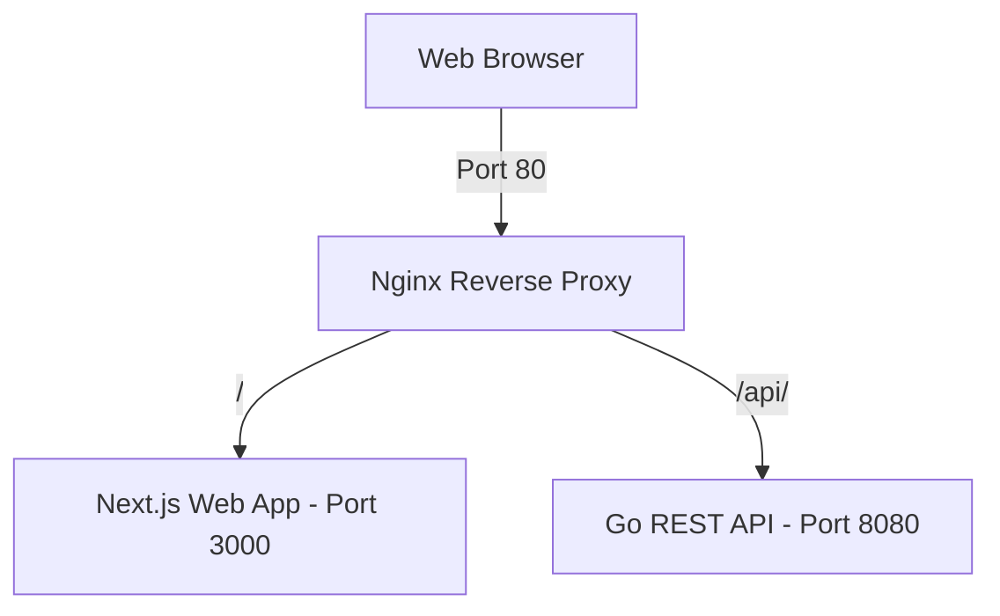

# CrowdFlow — Event Ticketing & Venue Management Platform

Welcome to **CrowdFlow**, a scalable, high-performance event ticketing and venue management system. 

This repository is structured as a monorepo containing a high-concurrency Go backend API, a modern Next.js frontend web app, and an Nginx reverse proxy routing gateway.

---

## Architecture Overview



* **Frontend:** Next.js application configured for standalone Docker optimization (Node.js 20-alpine).
* **Backend:** REST API built in Go (1.26+) utilizing standard routing mechanisms, built for fast concurrency execution.
* **Nginx Reverse Proxy:** Serves as the primary entry point, routing requests dynamically to frontend or backend services while maintaining same-origin integrity (bypassing the need for complex CORS configurations).

---

## Prerequisites

Before running the application, make sure you have the following installed on your machine:

1. **Docker & Docker Compose** (highly recommended for uniform local environment testing)
2. **Go (v1.26.2 or later)** (for local backend development)
3. **Node.js (v20 or later) & npm** (for local frontend development)

---

## Quick Start (Using Docker Compose)

The easiest way to boot the entire stack (frontend, backend, and proxy gateway) is using Docker Compose.

1. Clone or pull the latest changes in the repository.
2. In the root directory, build and run the services:
   ```bash
   docker compose up --build
   ```
3. Once the build finishes and the containers boot up:
   * **Web App (Next.js):** Access it at [http://localhost](http://localhost) (mapped via Nginx proxy).
   * **API Health Check:** Query the endpoint at [http://localhost/api/health](http://localhost/api/health) (or check backend directly at [http://localhost:8080/api/health](http://localhost:8080/api/health)).

To stop the containers:
```bash
docker compose down
```

---

## Local Development (No Docker)

If you wish to run the frontend and backend services outside of Docker containers directly on your host machine:

### 1. Run the Backend (Go)
1. Navigate to the backend directory:
   ```bash
   cd backend
   ```
2. Start the Go server:
   ```bash
   go run main.go
   ```
   *The server runs directly on [http://localhost:8080](http://localhost:8080).*

### 2. Run the Frontend (Next.js)
1. Navigate to the frontend directory:
   ```bash
   cd frontend
   ```
2. Install npm dependencies:
   ```bash
   npm install
   ```
3. Start the Next.js development server:
   ```bash
   npm run dev
   ```
   *The client dev server runs on [http://localhost:3000](http://localhost:3000).*

*Note: When running without Nginx locally, calling endpoints from the frontend to the backend will cross origins (`localhost:3000` to `localhost:8080`). You may need to temporarily enable CORS in your Go router or configure Next.js rewrites in `next.config.ts` for local non-Docker development.*

---

## API Endpoints

| Method | Endpoint | Description | Expected Output |
| :--- | :--- | :--- | :--- |
| `GET` | `/api/health` | Health Check verification | `{"status":"ok","message":"CrowdFlow API is running"}` |

---

## Folder Structure

```text
CrowdFlow/
├── backend/            # Go REST API source code
│   ├── Dockerfile      # Optimized alpine multi-stage build
│   ├── go.mod          # Go module file
│   └── main.go         # API Entrypoint
├── frontend/           # Next.js web application
│   ├── Dockerfile      # Standalone static asset multi-stage build
│   ├── public/         # Next.js static assets
│   ├── src/            # Next.js pages and app router components
│   └── next.config.ts  # Next config outputting standalone
├── nginx/              # Nginx proxy routing configuration
│   └── nginx.conf      # Routing rules (Port 80 proxy pass config)
└── docker-compose.yml  # Local stack orchestration setup
```
