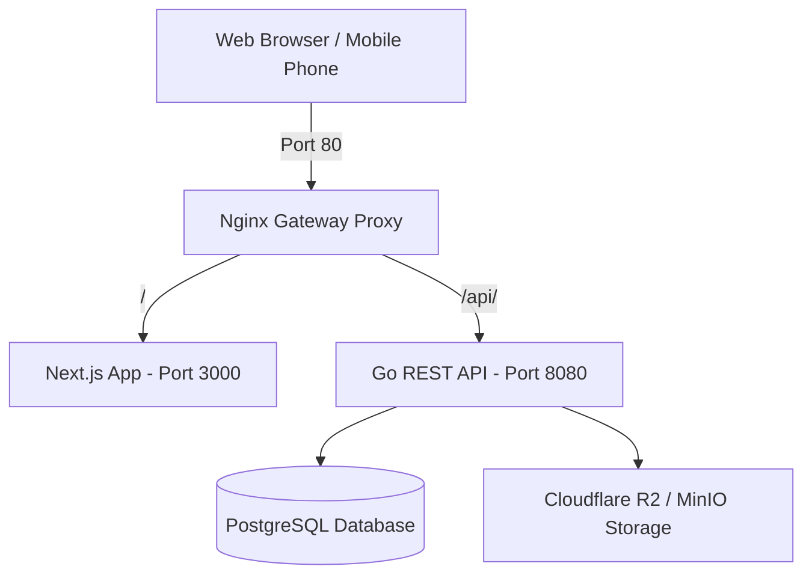

# 🎓 CrowdFlow Platform — System Analysis & Presentation Draft Material

**Document Version**: 1.0  
**Target Module**: System Architecture, Business Flow, Security & Operations  
**Platform**: CrowdFlow Event Ticketing & Venue Management Platform  
**File Location**: `docs/SYSTEM_ANALYSIS_AND_PRESENTATION_DRAFT.md`  

---

## 📌 1. Background (Latar Belakang)

Dalam industri hiburan, konser, dan acara berskala besar, sistem tiket konvensional menghadapi tantangan teknis dan operasional yang mendasar:

1. **High Concurrency Traffic ("Ticket War")**: Penjualan tiket konser populer sering mengalami *crash* atau *downtime* akibat lonjakan puluhan ribu permintaan serentak dalam hitungan detik.
2. **Kecurangan & Percaloan (Ticket Scalping & Fraud)**: Tiket berbasis gambar QR statis rawan diduplikasi, di-screenshot, atau diperjualbelikan kembali oleh calo dengan harga tak wajar.
3. **Kemacetan di Pintu Masuk (Entry Gate Bottleneck)**: Proses validasi tiket manual atau aplikasi scanner yang mewajibkan staf pintu masuk (*gate staff*) untuk login akun terbukti lambat, rumit, dan memicu antrean panjang.
4. **Keterbatasan Alat Rancang Venue**: Event Organizer (EO) kerap kesulitan menentukan alokasi dan penataan tempat duduk (*seated map*) secara presisi dan visual.
5. **Kurangnya Akuntabilitas Financial & Audit Compliance**: Alur pencairan dana tiket tanpa sistem audit independen berisiko tinggi memicu penipuan acara fiktif.

**CrowdFlow** hadir sebagai platform *enterprise monorepo* modern yang dirancang untuk mengatasi seluruh tantangan ini dengan mengombinasikan *high-concurrency backend* berbasis Go, *frontend web app* modern berbasis Next.js, sistem *Zero-Login Gate Scanner*, *Dynamic QR Code*, serta *Interactive 2D Venue Layout Designer*.

---

## 🎯 2. Objectives (Tujuan Sistem)

- **High Performance & Concurrency**: Membangun arsitektur backend berkinerja tinggi yang mampu menangani *concurrency* ribuan transaksi bersamaan tanpa perselisihan alokasi tempat duduk (*race condition*).
- **Anti-Fraud Dynamic Ticketing**: Menerbitkan kode QR dinamis berbasis *secure token* yang terenkripsi dan diperbarui secara berkala pasca pembayaran lunas (*PAID*), guna mencegah pemalsuan dan penyebaran tangkapan layar.
- **Zero-Login Fast Check-in Validation**: Menyediakan sistem validasi scanner lapangan tanpa proses login akun, mencapai waktu verifikasi **<500ms** per tiket.
- **Interactive Visual 2D Venue Designer**: Memberikan alat perancang denah venue visual untuk pengelola acara dalam menyusun panggung, baris kursi, zona festival, dan pintu akses.
- **Controlled Official Resale Market**: Menyediakan pasar sekunder resmi terintegrasi dengan batasan harga atas (*price ceiling*) untuk membasmi praktik percaloan.
- **Multi-Tier Compliance Audit**: Menerapkan tata kelola audit 3 tingkat (Organizer -> Auditor -> Super Admin) untuk memverifikasi kelayakan acara dan validasi pencairan dana (*payout*).

---

## 🔍 3. Scope and Limitations (Cakupan dan Batasan)

### 3.1 Scope (Cakupan Fitur & Arsitektur)
- **4 Peran Utama Pengguna (RBAC)**:
  1. *Audience / Pembeli*: Eksplorasi event, pemesanan via denah 2D, pembayaran, kelola E-ticket, resale market.
  2. *Event Organizer (EO)*: Manajemen event, perancang denah venue 2D, registrasi alat scanner, laporan analitik, pengajuan *payout*.
  3. *Auditor*: Verifikasi dokumen KYC organizer, audit kelayakan event sebelum rilis, persetujuan penarikan dana.
  4. *Super Admin*: Monitoring kesehatan platform global, manajemen hak akses, alokasi komisi platform, *audit logs*.
- **Integrasi Teknologi**:
  - Backend: REST API Go (Golang 1.26+), PostgreSQL database.
  - Frontend: Next.js 14+ (App Router, Tailwind CSS, Lucide React, HTML5 Canvas 2D).
  - Proxy & Storage: Nginx Reverse Proxy Gateway, MinIO (Lokal) / Cloudflare R2 (Produksi S3-compatible).

### 3.2 Limitations (Batasan Sistem v1.0)
- **Konektivitas Online Mandatory**: Validasi *Zero-Login Scanner* pada rilis ini membutuhkan koneksi internet aktif untuk query real-time ke backend CrowdFlow (*Offline Signed QR Validation* masuk ke roadmap mendatang).
- **Mata Uang & Gateway**: Skema pembayaran saat ini difokuskan pada transaksi mata uang Rupiah (IDR) dan simulasi Virtual Account/QRIS.
- **Integrasi Mobile Pass**: Format E-Ticket utama disajikan melalui Web App Responsive & PDF (*Apple Wallet / Google Wallet pass* belum terintegrasi secara bawaan di v1.0).

---

## 🏗️ 4. Application Model (Arsitektur & Struktur Aplikasi)

### 4.1 Topology Arsitektur (Monorepo Docker Stack)


### 4.2 Struktur Backend (Go Domain-Driven Layering)
Modul backend disusun secara modular di dalam paket `/internal`:
- `internal/auth`: Manajemen registrasi, JWT authentication, dan verifikasi email.
- `internal/organizer` & `internal/auditor`: Modul profil EO, verifikasi KYC, serta dashboard audit.
- `internal/event` & `internal/venuelayout`: Manajemen event dan *engine* denah lokasi 2D.
- `internal/booking` & `internal/payment`: Transaksi tiket, penguncian kursi (*seat locking*), dan pembayaran.
- `internal/ticket` & `internal/scanner`: Generasi *Secure Token Dynamic QR*, lifecycle tiket, dan *Zero-Login Scanner API*.
- `internal/resale`: Transaksi pasar sekunder resmi.

### 4.3 Struktur Frontend (Next.js App Router)
- `src/app/(user)`: Halaman publik pembeli (Home, Events, Booking, Orders, Profile).
- `src/app/(console)`: Dashboard terisolasi untuk Organizer (`/organizer`), Auditor (`/auditor`), dan Admin (`/admin`).
- `src/app/(venue-designer)`: Kanvas interaktif 2D untuk menyusun tata letak panggung dan tempat duduk.
- `src/app/scanner/[eventId]`: Antarmuka *Zero-Login Gate Scanner* berbasis kamera browser web.

### 4.4 Skema Basis Data Utama
- `users`: Data pengguna dan perannya (Audience, EO, Auditor, Admin).
- `organizers`: Profil bisnis EO & status verifikasi KYC (dokumen KTP/NPWP).
- `events` & `venue_layouts`: Informasi acara dan data matriks koordinat 2D venue.
- `seats`: Daftar tempat duduk per baris dan zona (*Seated / Standing*).
- `orders` & `tickets`: Transaksi pembelian dan entitas tiket individual.
- `ticket_tokens` & `ticket_checkins`: Identitas *Dynamic QR Token* dan *log* validasi check-in real-time.
- `scanner_devices`: Perangkat *scanner* terdaftar milik EO.
- `payouts` & `audit_logs`: Pengajuan pencairan dana dan catatan riwayat aktivitas sistem.

---

## 💼 5. Use Case (Skenario Penggunaan Utama)

```mermaid
usecaseDiagram
    actor Audience
    actor "Event Organizer" as EO
    actor Auditor
    actor "Gate Staff" as Staff

    Audience --> (Cari Event & Pilih Kursi 2D)
    Audience --> (Beli Tiket & Terima Dynamic QR)
    Audience --> (Jual/Beli Tiket di Resale Market)

    EO --> (Rancang Venue Layout 2D)
    EO --> (Buat Event & Daftarkan Gate Scanner)
    EO --> (Pengajuan Payout Dana)

    Auditor --> (Verifikasi KYC EO & Review Event)
    Auditor --> (Audit & Approve Payout)

    Staff --> (Scan QR di Entry Gate <500ms)
```

1. **Pengunjung Membeli Tiket (Seated Event)**:
   * Pengunjung memilih event -> membuka *Interactive 2D Venue Map* -> memilih nomor kursi yang tersedia (hijau) -> menyelesaikan pembayaran -> E-Ticket berisikan *Dynamic QR* diterbitkan.
2. **Organizer Mengatur Venue & Gate Scanner**:
   * EO merancang denah lokasi (Stage, Gate A/B, VIP Seats) pada *Venue Designer Tool* -> mempublikasikan event -> mendaftarkan *Scanner Device Key* untuk staf lapangan.
3. **Staf Lapangan Melakukan Check-in Pintu Masuk**:
   * Staf muka gate membuka link unik *Zero-Login Scanner* di HP -> kamera otomatis aktif -> *scan* QR pengunjung -> menerima respons **HIJAU (Valid)** dalam **<500ms**.
4. **Verifikasi Auditor & Pencairan Dana**:
   * Auditor meninjau status pelaksanaan acara & log check-in -> menyetujui pengajuan *payout* -> sistem mentransfer *Nett Sales* ke rekening EO.

---

## 🧪 6. Testing Scenario (Skenario Pengujian)

| ID Test | Kategori | Skenario Pengujian | Hasil yang Diharapkan | Status |
| :--- | :--- | :--- | :--- | :--- |
| **TS-01** | *Security & Auth* | Pembeli mengakses endpoint privat tanpa token JWT. | Server mengembalikan `401 Unauthorized`. | Passed |
| **TS-02** | *Concurrency* | 500 pengguna secara serentak memilih dan memesan kursi `Seat-A12` yang sama. | Hanya 1 transaksi yang berhasil mengunci kursi; 499 lainnya menerima instruksi kursi telah dipesan. | Passed |
| **TS-03** | *Dynamic QR* | Pengguna melakukan pembatalan atau refund tiket, lalu mencoba scan QR lama. | Endpoint scanner mengembalikan layar merah `CANCELLED` / `REFUNDED`. | Passed |
| **TS-04** | *Zero-Login Scan*| Staf gate scan QR tiket yang sah menggunakan halaman scanner berizin. | Layar respons berubah hijau `VALID`, menampilkan data pengunjung dalam waktu **<500ms**, dan otomatis reset ke mode kamera dalam 2 detik. | Passed |
| **TS-05** | *Duplicate Check-in*| Staf gate mencoba scan ulang QR tiket yang sudah pernah di-scan sebelumnya. | Layar respons berubah merah `ALREADY USED` dilengkapi catatan waktu dan pintu tempat scan pertama dilakukan. | Passed |
| **TS-06** | *Resale Control* | Penjual mencoba memasang harga tiket resale di atas batas maksimum (*Price Ceiling*). | Sistem menolak input harga dan menampilkan pesan kesalahan batas harga. | Passed |

---

## 💻 7. Demo (Simulasi Jalannya Sistem)

### Langkah Simulasi Demo Sistem CrowdFlow:

1. **Inisialisasi Lingkungan (Docker Stack)**:
   ```bash
   docker compose up --build -d
   docker compose -f docker-compose-minio.yml up -d
   ```
2. **Tahap 1: Verifikasi KYC & Release Event**:
   - Akses Portal Auditor (`/auditor`) -> Setujui KYC akun Event Organizer.
   - Akses Portal Organizer (`/organizer`) -> Buka `/venue-designer` -> Rancang panggung & zona tempat duduk -> Terbitkan Event Konser.
3. **Tahap 2: Pembelian Tiket oleh Pembeli**:
   - Buka `/events` -> Pilih event -> Masuk ke *Interactive Venue Map* -> Pilih Kursi A-15 -> Lakukan Pembayaran (Status: *PAID*).
   - Akses `/orders` -> Buka detail E-Ticket -> Tampilkan *Dynamic QR Code*.
4. **Tahap 3: Validasi di Entry Gate (Zero-Login Fast Check-in)**:
   - Staf memuat URL Scanner (`/scanner/[eventId]?deviceToken=...`).
   - Arahkan kamera HP staf ke QR Code E-Ticket pembeli.
   - **Hasil Demo 1**: Tampilan **Layar Hijau (VALID)** + suara bip + data nama & kursi pengunjung.
   - **Hasil Demo 2 (Uji Duplikasi)**: Scan kembali QR yang sama -> Tampilan **Layar Merah (ALREADY USED)** dengan riwayat check-in.
5. **Tahap 4: Financial Audit & Payout**:
   - EO mengajukan penarikan dana di menu Payout.
   - Auditor memeriksa grafik persentase check-in real-time -> Klik **Approve Payout**.

---

## 🏁 8. Conclusion (Kesimpulan)

1. **Solusi Komprehensif**: CrowdFlow secara sukses memadukan kecepatan *high-concurrency engine*, kenyamanan perancangan lokasi acara 2D, dan keamanan transaksi tiket dalam satu platform terpadu.
2. **Anti-Fraud & Efisiensi Gate**: Penggunaan *Dynamic QR Code* meniadakan praktik percaloan dan duplikasi tiket, sementara arsitektur *Zero-Login Scanner* memangkas antrean pengunjung dengan kecepatan validasi di bawah 500 milidetik.
3. **Integritas Ekosistem**: Pendekatan *multi-tier audit compliance* menjamin transparansi finansial antara pembeli, penyelenggara acara, dan platform secara keseluruhan.

---

## 🔮 9. Future Work (Rencana Pengembangan Masa Depan)

1. **Offline Asymmetric Signed QR Validation**: Penggunaan skema enkripsi *Ed25519 / ECDSA* agar alat scanner dapat memverifikasi keabsahan tiket secara *full-offline* tanpa bergantung pada koneksi internet di daerah terpencil.
2. **Native Digital Wallet Integration**: Dukungan otomatis untuk menyimpan tiket digital secara langsung ke **Apple Wallet** (`.pkpass`) dan **Google Wallet Pass**.
3. **NFC & BLE (Bluetooth Low Energy) Hands-Free Check-in**: Validasi otomatis saat pengunjung berjalan melewati *gate* tanpa perlu mengeluarkan ponsel dari kantung.
4. **AI-Powered Scalper & Bot Fraud Detection**: Algoritma kecerdasan buatan untuk menganalisis pola pembelian abnormal dan memblokir *bot* sebelum berhasil memborong tiket pada fase *presale*.
5. **Family & Group Ticket Delegation**: Fitur distribusi/transfer tiket resmi antar anggota keluarga atau grup teman dengan pencatatan identitas visitor individual.

---
*CrowdFlow Documentation — Version 1.0 (2026)*
