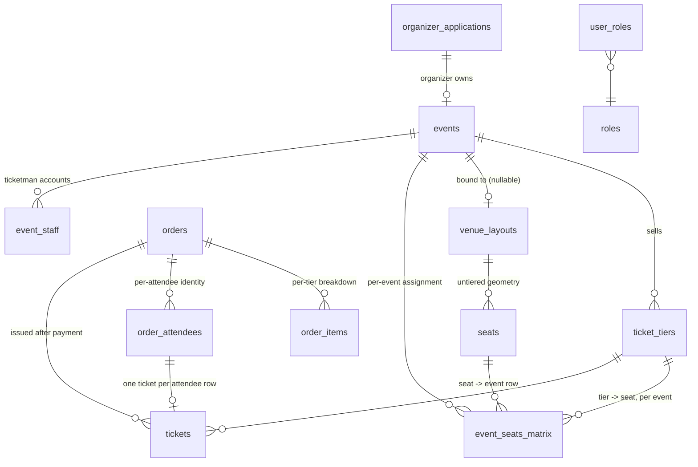

# Data Model

## Core tables and how they relate



| Table | Purpose |
|---|---|
| `events` | One row per event; `organizer_id`, `status`, `published_at`, `archived_at`, `layout_id` (nullable), `max_tickets_per_order` |
| `ticket_tiers` | Priced tiers per event: `allocation_limit`, `tickets_sold`, `visibility`, `sales_start`/`sales_end` |
| `venue_layouts` / `seats` | Reusable, **untiered** physical geometry — a venue template |
| `event_seats_matrix` | Per-event, per-seat assignment: which tier a seat belongs to *for this event*, and its live `current_state` |
| `orders` / `order_items` | An order and its per-tier line items — the authoritative source for money |
| `order_attendees` | Per-attendee identity captured at checkout (name, encrypted NIK, email, phone, dob), one row per ticket to be issued |
| `tickets` | One issued ticket per attendee, carrying `secret_key` (the rotating-QR credential), `ticket_status`, `unit_price` |
| `payouts` | Organizer payout requests/lifecycle |
| `organizer_applications` | Organizer onboarding + payout bank details (`bank_name`, `bank_account_number`, `bank_verification_status`) |
| `user_roles` | Platform roles (`event_id IS NULL`) and event-scoped roles (`event_id` set), joined to `roles` |
| `event_staff` | Ticketman accounts, one per (event, person) — see `ticketing-and-checkin.md` |

## Seat tiering: venue templates are untiered, tiering is per-event

A `venue_layouts` + `seats` pair is a reusable physical template — rows,
numbers, `pos_x`/`pos_y` coordinates, nothing about price or tier. Which
tier a given seat sells under is decided **per event**, in
`event_seats_matrix` (`ticket_tier_id`, `event_id`, `seat_id`,
`current_state`). The same physical seat can be a "VIP" seat for one event
and a "General" seat for another event run in the same venue, because the
tier assignment lives on the event-scoped join table, not on the seat or the
layout.

`event_seats_matrix.current_state` is the seat's live booking status for
*this event* ("available"/"held"/"sold"/"blocked") — a completely different
thing from `seats.seat_status`, which is the seat's physical/venue-level
condition independent of any event
(`backend/internal/booking/repository.go:63-64`, doc comment on
`GetSeatMap`).

## Where sales/revenue figures actually come from

**Historically**, `ticket_tiers.tickets_sold` was never written by any code
path, so anything computed from it (revenue, "tickets sold" counts) was
structurally stuck at zero. The fix (migrations 0023-0026, per project
history) moved payout/revenue computation onto `orders` and `order_items` —
an order's line items are the ground truth for what was actually paid.

**As of the current code**, this is no longer the whole story:
`ticket.GenerateTicketsForPaidOrder` (`backend/internal/ticket/repository.go:196-340`)
now writes `tickets_sold` at settlement too — incrementing it per GA tier in
the same transaction that inserts the tickets and marks assigned seats sold
(`repository.go:327-333`). So today:

- **Money/revenue** still comes from `orders`/`order_items` — that has not
  changed and remains the correct source.
- **`ticket_tiers.tickets_sold`** is now a real, transactionally-maintained
  inventory counter, not a permanently-zero column. It is read live by the
  GA-hold capacity check (`booking/repository.go:474-476`,
  `AcquireGAHold`) and is backed by a database-level guarantee (below) so it
  can never exceed the tier's `allocation_limit`.

Document both states if you're relying on older notes or handoffs: the
"tickets_sold is never written" fact was true when written and is no longer
true.

## Migration-0040 database backstop

Two application-logic fixes (GA hold rework, `tickets_sold` writes) closed
the practical overselling bug, but application logic can regress. Migration
`0040_inventory_db_backstop.sql` adds two DB-level guarantees that hold
regardless of what future application code does:

1. A **partial unique index** on `tickets(event_seats_matrix_id) WHERE
   event_seats_matrix_id IS NOT NULL` — two tickets can never reference the
   same seat; the second `INSERT` fails outright. Partial, not plain
   `UNIQUE`, because GA tickets carry `event_seats_matrix_id = NULL` and a
   plain unique constraint treats multiple `NULL`s as distinct (so it would
   silently do nothing for GA tickets rather than nothing-by-design).
2. A **`CHECK (tickets_sold <= allocation_limit)`** constraint on
   `ticket_tiers` — a GA tier's sold count cannot exceed its cap, no matter
   what writes to it.

## Idempotency guard against double-issuance

`GenerateTicketsForPaidOrder` checks for existing tickets on the order
*before* inserting anything (`repository.go:213-221`): if
`COUNT(*) FROM tickets WHERE order_id = $1 > 0`, it returns the existing
count and commits without doing anything else. This makes a retried
Midtrans webhook delivery — which Midtrans's own delivery model guarantees
can happen — safe to call twice: the second call is a no-op read, not a
second issuance.

## Migration system mechanics

Migrations live as numbered `.sql` files in `backend/migrations/`, applied
via `backend/migrations/run_all.sql`:

```
psql "$DB_DSN" -f backend/migrations/run_all.sql
```

### Why every migration needs TWO entries in `run_all.sql`

`run_all.sql` maintains its own ledger table, `crowdflow_migrations`, keyed
by **filename**, not by migration number (see below). Because most existing
databases predate this runner, the script has two distinct code paths:

1. **Adopt step** (only runs when the ledger is empty): probes the database
   for each migration's expected artifact (a table, column, enum value,
   constraint) using `to_regclass`/`information_schema` helpers, and records
   any migration whose artifact is already present *without re-running it*.
   This is what lets the runner be pointed at an already-migrated database
   without replaying `CREATE TABLE` statements that would error the second
   time.
2. **Apply step**: for a migration not yet in the ledger, actually runs the
   file and then records it.

A migration therefore needs one entry in the adopt-probe list (how to detect
it's already applied) and one entry in the apply list (how to actually apply
it) — hence "two entries per migration." This is deliberate, not
duplication: skipping the adopt-probe entry would make a fresh
already-migrated database try to re-run a migration that uses a bare
`CREATE TABLE`/`ALTER TYPE ... ADD VALUE` (no `IF NOT EXISTS`), which is a
hard error on replay.

### Why the ledger key is a filename, not a number

Three migration numbers exist **twice**, as separate files:

- `0008` — `0008_scanner_system.sql` and `0008_venue_layouts.sql`
- `0011` — `0011_qr_ticket_tokens.sql` and `0011_seat_tiering.sql`
- `0014` — `0014_dynamic_ticket_v2.sql` and `0014_venue_postal_code.sql`

(all six confirmed present via directory listing of `backend/migrations/`)

Keying the ledger by number would record one of each pair and silently skip
its twin forever. Keying by filename and applying in filename order avoids
that.

### Permanent gaps at 0034/0035

No `0034_*.sql` or `0035_*.sql` file exists in `backend/migrations/` — the
numbering jumps from `0033_booking_access_log.sql` directly to
`0036_event_staff.sql`. Confirmed by directory listing; these numbers were
allocated and then abandoned (e.g. a branch that didn't land), and nothing
in `run_all.sql` references them. This is a permanent, intentional-by-omission
gap, not a sign of missing files to track down.

### Latest schema state

As of this branch, the most recently added migrations are:

- **`0039_payment_method_snap.sql`** — adds the `'snap'` value to the
  `payment_method` enum (Midtrans Snap integration).
- **`0040_inventory_db_backstop.sql`** — the two constraints described
  above.

## NIK (Indonesian ID) handling

Per-seat/per-attendee NIK is captured at checkout into
`order_attendees.nik_enc` (AES-GCM encrypted, migration
`0032_order_attendees.sql`). The migration is pure DDL — it does not encrypt
existing data — a separate one-shot Go command (`cmd/backfill_nik`)
encrypts any legacy plaintext `tickets.attendee_nik` values into
`tickets.attendee_nik_enc` and nulls the plaintext column afterward
(encrypt-then-null, idempotent). NIK is never logged or returned to the
buyer-facing "my tickets" API (see `Ticket` struct's comment,
`backend/internal/ticket/entity.go:17-20`) — only organizer/ticketman-facing
paths ever see a decrypted NIK.
