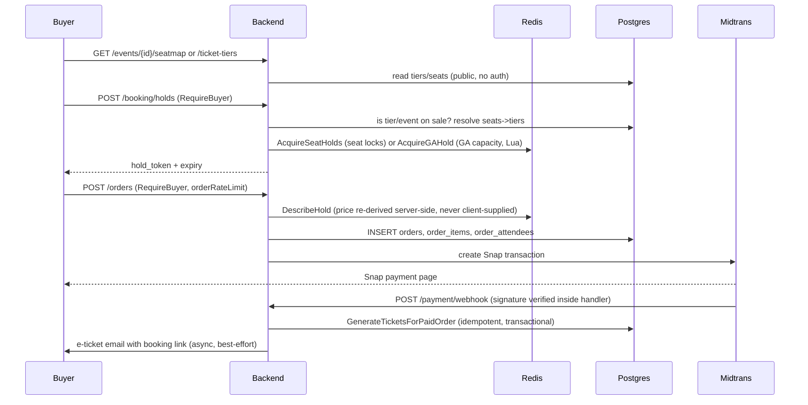

# Purchase and Inventory

This covers the full buyer flow — browse, hold, pay, ticket issuance — and
the mechanisms that make overselling structurally impossible rather than
merely unlikely.

## Flow overview

## Holds: seat locks vs. GA capacity keys

Assigned-seating holds and general-admission holds use **different Redis
mechanisms**, both in `backend/internal/booking/repository.go`:

### Assigned seating: one lock key per seat

`AcquireSeatHolds` (`repository.go:395-413`) is a simple `SETNX` per seat
with a TTL, all-or-nothing: if any seat in the request is already locked,
every lock acquired so far in that call is released and the whole
acquisition fails. `ReleaseSeatHolds` uses a compare-and-delete Lua script
(`releaseIfMatchScript`, `repository.go:387-393`) so a hold that already
expired and was re-acquired by someone else is never released out from
under its new owner.

### General admission: per-hold TTL keys, not a shared counter

This was **recently reworked away from a single shared counter**, which
leaked capacity whenever a hold's TTL expired without an explicit release
(the old design decremented a counter on acquire and incremented it back on
release, but a lapsed TTL never called release, so that capacity was gone
forever). The current mechanism (`repository.go:426-490`):

- Each GA hold gets its **own** TTL'd Redis key (`gaHoldKey`, holding the
  quantity reserved).
- A per-tier Redis **set** (`gaHoldIndexKey`) lists the full names of every
  currently-outstanding hold key for that tier — the only way to sum
  "currently held" without an unbounded `KEYS`/`SCAN`.
- Remaining capacity is computed **live, every call**, as
  `allocation_limit - tickets_sold` (read fresh from Postgres — never
  cached, since a cached/reseeded counter is exactly the old leak's root
  cause) minus the live sum of that tier's still-active hold keys.
- The whole "read the set, sum still-alive holds, prune stale entries,
  compare against capacity, reserve" sequence runs as a **single atomic Lua
  script** (`acquireGAHoldScript`, `repository.go:436-461`), so two
  concurrent acquisitions against the same tier can never both observe
  capacity that only one of them can actually have.
- A hold's own key naturally self-heals the index when it expires: the next
  call's script prunes any index member whose key is already gone
  (`repository.go:449-451`). There is no separate sweep/cron needed.

## Order creation and pricing

Prices are **never trusted from the client**. `DescribeHold`
(`repository.go:586-672`) re-reads tier price, event title, and seat labels
from Postgres at order-creation time, keyed off the hold token — the hold
itself was built from server-resolved tier assignments
(`ResolveSeatTiers`), so a client cannot pair a cheap tier's id with another
tier's seats to get charged the cheap price (this was a real, since-closed
issue — see the doc comment on `HoldRequest`, `entity.go:73-83`).

`GetMaxTicketsPerOrderByTier` (`repository.go:263-278`) resolves the
per-order ticket cap through the **tier**, never through a client-supplied
event id — the cap (`events.max_tickets_per_order`, a single total across
every tier in the order, not a per-tier cap) is looked up via
`ticket_tiers.event_id` so a request can't quote one event's cap while
buying against another event's tier.

## Midtrans Snap integration and the payment webhook

`POST /api/v1/payment/webhook` is intentionally **unauthenticated** at the
route level — Midtrans calls it directly, so it can't carry a session
cookie. Signature verification happens *inside* the handler, before the
payload is read, so a request with a bad signature is rejected before any
of its content is trusted. Both the webhook and the buyer-triggered
"complete payment" endpoint (`POST /orders/complete-payment`) mint tickets
through the exact same code path (`payment.TicketIssuer`, wired to
`ticketService` in `main.go:299-301`), so there is only one ticket-issuance
implementation in the whole system to keep idempotent.

## What makes double-issuance / overselling impossible

Two independent layers, described in detail in `data-model.md`:

1. **Application-level idempotency guard** —
   `ticket.GenerateTicketsForPaidOrder` (`backend/internal/ticket/repository.go:196-340`)
   checks for existing tickets on the order *before* the attendee-issuance
   loop runs (`repository.go:213-221`). A Midtrans webhook retry (which
   Midtrans's delivery model can legitimately produce) hits this check,
   finds tickets already exist, and returns without inserting anything a
   second time.
2. **Database-level backstop** — migration `0040_inventory_db_backstop.sql`:
   a partial unique index on `tickets.event_seats_matrix_id` (so two tickets
   can never reference the same seat) and a `CHECK` constraint
   (`tickets_sold <= allocation_limit` on `ticket_tiers`, so a GA tier can
   never be oversold by whatever writes `tickets_sold` — present code or
   future code). This layer holds even if the application-level guard above
   were ever removed or broken by a future change.

Both the seat-hold rework and the tickets_sold write were built in this same
session lineage — read `ticket/repository.go` and
`booking/repository.go` directly rather than trusting older
handoffs/summaries if the two ever seem to disagree, since this is exactly
the code that was being actively fixed.
