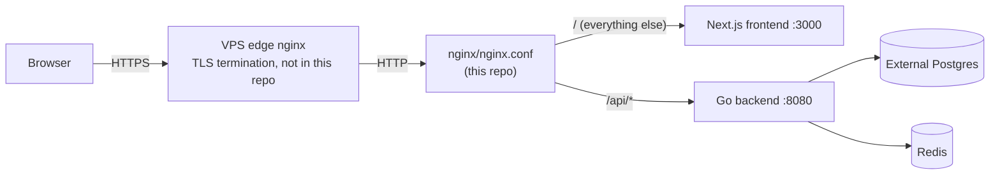

# System Overview

CrowdFlow is an event ticketing platform: buyers browse and buy tickets,
organizers create and run events, auditors gate-check organizer/event/payout
approvals, and a separate scanner staff role ("ticketman") checks tickets in
at the door. This document explains the moving pieces and how a request gets
from a browser to the database.

## Services

| Service | What it is | Where it lives |
|---|---|---|
| `frontend` | Next.js app — all four portals (buyer, organizer, auditor, admin, ticketman) | `frontend/` |
| `backend` | Go `net/http` API, no framework | `backend/` |
| `nginx` | Reverse proxy in front of frontend+backend, one Docker Compose service | `nginx/nginx.conf` |
| `redis` | Session store (refresh tokens) + seat/GA holds + rate-limit counters | image `redis:7-alpine`, AOF-persisted |
| Postgres | **Not** a Compose service — an external/managed database reached over the network | `backend/.env.example`: `DB_DSN=postgres://...@host.docker.internal:5432/...` |

`docker-compose.yml` has no `postgres:` service block at all. The backend
container is handed a `DB_DSN` pointing at whatever Postgres instance the
deploying host configures (local dev commonly points it at
`host.docker.internal`) — the database's lifecycle is managed independently
of this Compose stack.

There are **two different nginx configurations** in this project, and they
are easy to conflate:

- `nginx/nginx.conf` (in this repo, baked into the `crowdflow-nginx` image) —
  sits *inside* the Compose network, in front of `frontend` and `backend`.
- The VPS/edge nginx that terminates TLS for the whole stack — **not in this
  repo**, configured directly on the host.

See `known-issues.md` for the edge nginx's upload cap, which is not the same
number as this repo's own nginx config.

## Request lifecycle

Inside the Compose network, `nginx/nginx.conf` routes purely on path prefix:
anything under `/api/` goes to the backend, everything else goes to the
Next.js frontend (`nginx/nginx.conf:33-70`). The backend itself wraps its
entire root mux in a single CSRF middleware (`backend/main.go:391`,
`middleware.CSRF`) — there is no per-route opt-out.

## The four portals

All four are pages in the same Next.js app (`frontend/src/app`), split by
route group and by which backend role guards their API calls:

| Portal | Frontend route group | Backend role required |
|---|---|---|
| Buyer-facing site | `(user)`, `booking/`, `events/`, root | `User` (buyer) role, or unauthenticated for browsing |
| Organizer console | `(console)/organizer`, `business/` | `Event Organizer` platform role |
| Auditor console | `(console)/auditor` | `Auditor` platform role |
| Admin console | `(console)/admin` | `Super Admin` platform role |
| Ticketman (scanner) portal | `ticketman/` | ticketman session (`event_staff` row), **not** a platform role at all |

The ticketman portal is deliberately outside the platform's role system
entirely — see `auth-and-roles.md` for why it has its own login and its own
JWT secret.

## `/api/v1` versioning — and why two packages are NOT versioned

`backend/main.go` builds two sub-routers, `apiV1` and `adminV1`, and mounts
them at `/api/v1/` and `/api/v1/admin/` respectively (`main.go:100-101`,
`main.go:314-315`) using `http.StripPrefix`, so every handler in those
packages registers a bare pattern (e.g. `GET /events`) and the version
prefix is applied once, at mount time.

Two packages — **`organizer`** and (implicitly, via routes it registers
directly) the user-facing account/staff/delegation surface — were
**deliberately skipped** in an "api/v1 cut" migration and register straight
onto the root `mux` instead of `apiV1`, producing bare `/api/organizer/...`,
`/api/ticketman/...`, `/api/scanner/...` (partially — see below),
`/api/resale/...`, and `/api/notifications` paths. This is confirmed
directly in `main.go`:

- `organizerHandler.RegisterRoutes(mux, ...)` — `main.go:329`
- `eventStaffHandler.RegisterRoutes(mux, ...)` — `main.go:338`
- `ticketmanHandler.RegisterRoutes(mux, ...)` — `main.go:352`
- `delegationHandler.RegisterRoutes(mux, ...)` — `main.go:360` (its
  admin-oversight routes, `RegisterAdminRoutes`, *do* go on `adminV1` —
  `main.go:363`)
- `auditorHandler.RegisterRoutes(mux, ...)` — `main.go:373` (auditor
  hardcodes its own `/api/v1/auditor/...` prefix internally, so it reads as
  versioned even though it bypasses the `apiV1` sub-router)
- `resaleHandler.RegisterRoutes(mux, ...)` — `main.go:388`

This means the frontend's organizer-console API calls to bare `/api/...`
paths are **correct as they stand** — they are not stragglers from an
incomplete migration and should not be "fixed" by prefixing them with
`/v1/`.

### `internal/scanner` is internally inconsistent

Unlike every other bare-mounted package, `internal/scanner` hardcodes **two
different prefixes on itself**, registered in the same
`RegisterRoutes` call:

- The ticketman-facing scan-execution endpoints
  (`checkin`/`reject`/`dashboard`/`my-log`) are registered at
  **`/api/v1/scanner/...`** (versioned).
- The organizer-facing gate CRUD (create/list/delete a physical check-in
  gate) is registered at **`/api/scanner/...`** (no `/v1`).

Both are mounted onto the same root `mux` in `main.go:380`. Every other
package that owns its own full prefix is consistently un-versioned
(organizer, eventstaff, ticketman, delegation, resale) or consistently
versioned (auditor); scanner is the only one that disagrees with itself.
This is a naming inconsistency, not a functional bug — both prefixes work,
neither collides with anything else.

## Key architectural decisions carried through this document set

- Seat tiering is per-seat and per-event, not baked into reusable venue
  geometry — see `data-model.md`.
- Money/sales figures are computed from `orders`/`order_items`, with
  `ticket_tiers.tickets_sold` now also correctly maintained as of a recent
  migration — see `data-model.md`.
- There are two completely separate session/auth systems (ordinary users vs.
  ticketman) — see `auth-and-roles.md`.
- The e-ticket booking link is the *only* path a buyer has to their ticket —
  no PDF, no QR image over email — which is why email deliverability is a
  severe issue, covered in `known-issues.md`.
