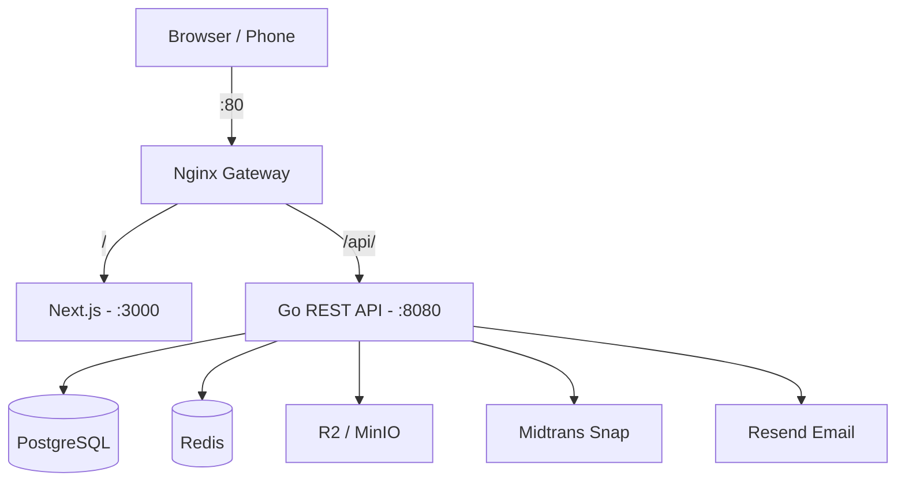
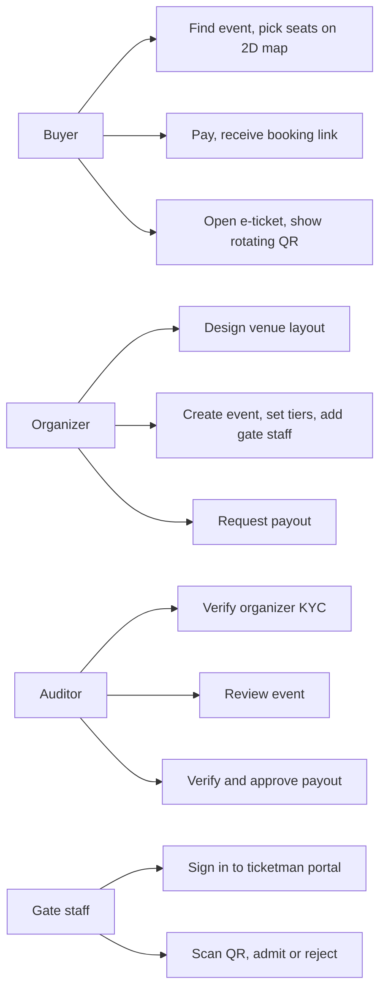

# CrowdFlow — System Analysis

A whole-system overview: the problem, the objectives, the architecture, and how
the platform is exercised. Written against the code as it stands.

For working detail, go to [../architecture/](../architecture/README.md). This
document is the wide view.

---

## 1. Background

Conventional ticketing for concerts and large events runs into five recurring
problems:

1. **High-concurrency traffic ("ticket war").** Popular on-sales take tens of
   thousands of simultaneous requests in seconds, and naive seat allocation
   either crashes or double-sells.
2. **Scalping and ticket fraud.** A static QR image can be screenshotted,
   forwarded, and resold. The image *is* the ticket, so copying it copies the
   entitlement.
3. **Entry-gate bottlenecks.** Manual validation is slow, and scanner apps that
   demand a full account login per staff member are slower still.
4. **Weak venue layout tooling.** Organizers need to lay out seating precisely
   and visually, then price it.
5. **No independent financial audit.** Ticket revenue paid out without
   independent verification invites fictitious-event fraud.

CrowdFlow addresses these as a monorepo platform: a Go backend, a Next.js
frontend, rotating-QR e-tickets, a dedicated staff check-in portal, and a 2D
venue layout designer.

## 2. Objectives

- **Concurrency safety** — no double-allocation of a seat under simultaneous
  purchase, enforced at the database level rather than only in application
  logic.
- **Anti-fraud dynamic ticketing** — a QR that rotates on a time step, so a
  screenshot is worthless within seconds.
- **Fast gate validation** — a purpose-built staff portal with its own
  lightweight session, scoped to the events and gates a staff member works.
- **Visual venue design** — a 2D canvas for stages, seat rows, GA zones and
  gates, with per-seat tier assignment.
- **Multi-tier compliance audit** — organizer KYC, event review, and payout
  verification as separate auditor workflows.

## 3. Scope and limitations

### 3.1 Roles

Five platform roles (detail in
[../architecture/auth-and-roles.md](../architecture/auth-and-roles.md)):

| Role | Responsibilities |
|---|---|
| **User / buyer** | Browse events, select seats, pay, hold e-tickets. Only accounts holding this role may purchase |
| **Event Organizer** | Event management, venue design, ticket tiers, staff, analytics, payout requests |
| **Auditor** | Organizer KYC, event review, payout verification, bank verification |
| **Admin** | User directory, roles, platform analytics, finance |
| **Super Admin** | Full access — **auto-passes `RequirePlatformRole`**, which is why authorization helpers that must exclude it are built separately |

**Ticketman** (gate staff) is deliberately *not* a platform role. It is a
separate credential system with its own JWT signing secret, so a compromised
scanner device cannot reach any user-facing API.

### 3.2 Technology

| Layer | Technology |
|---|---|
| Backend | Go 1.26.2, `net/http` standard library routing |
| Database | PostgreSQL 18 — 42 migrations |
| Cache / limits | Redis (holds, queue, rate limiting) |
| Frontend | Next.js 16 (App Router), TypeScript, Tailwind CSS v4 |
| State | Zustand; native `fetch` (no axios, no query library) |
| Storage | MinIO locally, Cloudflare R2 in deployed environments (S3-compatible, swapped by env only) |
| Payments | Midtrans Snap |
| Email | Resend |
| Edge | Nginx reverse proxy |
| CI/CD | GitHub Actions → GHCR; the VPS pulls images, never builds |

### 3.3 Limitations

- **Check-in requires connectivity.** The scanner validates against the server
  in real time. There is no offline validation path.
- **Indonesian market only.** IDR, Midtrans, and Indonesian compliance
  documents (KTP / NPWP / NIB).
- **Web only.** E-tickets are responsive web pages reached by a booking link.
  No native app, no Apple/Google Wallet passes.
- **Resale is built but switched off.** The backend package, API and UI all
  exist; `middleware.ts` redirects `/resale` to `/` by product decision.

## 4. Architecture

### 4.1 Topology



### 4.2 Backend packages

Domain-oriented under `backend/internal/`:

| Package | Responsibility |
|---|---|
| `auth` | Registration, login, access + refresh tokens, OAuth, sessions |
| `middleware` | Authentication, role gates, event ownership, rate limiting, CSRF |
| `organizer`, `auditor`, `admin` | The three console surfaces |
| `event`, `venuelayout` | Events and the 2D layout engine |
| `booking`, `payment` | Holds, orders, Midtrans Snap, webhook settlement |
| `ticket`, `ticketqr` | Ticket issuance and the rotating-QR contract |
| `eventstaff`, `ticketman`, `scanner` | Gate staff CRUD, staff auth, check-in |
| `delegation` | Co-organizer delegation |
| `nik` | Encrypted national-ID capture |
| `resale` | Secondary market (disabled at the edge) |
| `storage`, `mail`, `platform`, `config`, `response` | Infrastructure |

### 4.3 Frontend

Route groups map to portals — see
[routing.md](./routing.md) and
[../architecture/frontend.md](../architecture/frontend.md).

### 4.4 Core tables

| Table | Holds |
|---|---|
| `users`, `roles`, `user_roles` | Identity and RBAC (platform- and event-scoped) |
| `organizer_applications` | Organizer KYC, documents, payout bank details |
| `organizer_delegations` (+ `_events`) | Co-organizer grants |
| `events`, `venues`, `venue_layouts`, `seats` | Events and geometry |
| `ticket_tiers` | Pricing, per-event, assigned per seat |
| `orders`, `order_items` | Purchases and the full fee/tax breakdown |
| `tickets`, `ticket_tokens` | Issued tickets and QR secrets |
| `event_staff`, `event_staff_gates`, `event_staff_tiers`, `event_gates` | Gate staff and their scope |
| `ticket_checkins`, `scanner_logs` | Check-in record and audit trail |
| `payouts`, `activity_log`, `notifications` | Money out, audit, notifications |

`scanner_devices` was retired in migration 0037 — device tokens were replaced
by ticketman staff accounts.

## 5. Principal use cases



**1. Buyer purchases a seated ticket.** Browse → event detail → seat map →
select seats (held in Redis with a countdown) → checkout with per-attendee
details → Midtrans Snap → webhook settles the order → inventory commits →
booking link emailed.

**2. Organizer sets up an event.** Design the layout in the venue designer →
create the event and bind the layout → assign tiers per seat → upload event
documents → submit for auditor review → publish → add gate staff scoped to
gates and tiers.

**3. Gate staff check in an attendee.** Sign in to `/ticketman/login` → open
the dashboard for a granted event → scan the attendee's rotating QR → the
server re-derives the expected TOTP and admits or rejects.

**4. Payout.** Organizer requests a payout → auditor works the eleven-item
checklist against the revenue breakdown → approve, revise, hold or reject.

## 6. Verification

### 6.1 Automated tests

Eleven Go test packages cover the parts where correctness is subtle:

| Package | Covers |
|---|---|
| `internal/ticketqr` | The QR contract — encoding, TOTP derivation, tolerance |
| `internal/ticket` | Ticket issuance and inventory commit |
| `internal/booking` | GA hold and capacity mechanism |
| `internal/payment` | Midtrans integration and environment probe |
| `internal/middleware` | Buyer gate, rate limiting |
| `internal/auth` | Session lifecycle |
| `internal/delegation` | Delegation authorization |
| `internal/nik` | NIK encryption |
| `internal/config` | Environment parsing |

Run with `go test ./...` from `backend/`.

### 6.2 Scenarios still verified manually

These are the behaviours that matter most and are **not** yet covered by an
automated end-to-end test. Listed so they can be exercised deliberately rather
than assumed:

| ID | Scenario | Expected |
|---|---|---|
| TS-01 | Call a protected endpoint with no token | `401` |
| TS-02 | Signed-out `POST` | `403` (CSRF), not 401 |
| TS-03 | Two buyers race for the same seat | Exactly one succeeds; the other is told the seat is taken |
| TS-04 | GA tier sold to capacity | Further purchases refused; no oversell |
| TS-05 | Scan a QR whose TOTP window has passed | Rejected |
| TS-06 | Scan the same ticket twice | Second scan reports already used, with the first check-in's time and gate |
| TS-07 | Scan a valid ticket at a gate the staff member isn't granted | Rejected |
| TS-08 | Cancelled or refunded ticket presented at the gate | Rejected |

There is no load test for the concurrency claim in §2. Overselling is currently
prevented by two layers — settlement-time inventory commit and a database
partial unique index (migration 0040) — but the behaviour under thousands of
simultaneous requests has not been measured.

## 7. Running the system

Full instructions: [../onboarding/README.md](../onboarding/README.md).

```bash
docker compose up -d
```

Demo path:

1. **Auditor** approves an organizer's KYC documents at `/auditor/organizers`.
2. **Organizer** designs a layout at `/venue-designer`, creates an event,
   assigns tiers, submits for review.
3. **Auditor** approves the event at `/auditor/reviews`.
4. **Buyer** selects seats at `/events/[id]/seats`, checks out, pays through
   Midtrans Snap sandbox, and receives a booking link.
5. **Buyer** opens `/booking/[order_id]/t/[ticket_id]` and sees the rotating QR.
6. **Gate staff** sign in at `/ticketman/login` and scan it — then scan again to
   see the duplicate rejection.
7. **Organizer** requests a payout; **auditor** verifies and approves it at
   `/auditor/payouts/[id]`.

## 8. Conclusion

CrowdFlow combines high-concurrency inventory handling, visual venue design,
and rotating-QR ticketing in a single platform, with an independent audit tier
between organizers and their money.

The rotating QR closes the screenshot-forwarding hole that static QR ticketing
leaves open, and moving gate staff onto scoped accounts replaced shared device
tokens with per-person, per-gate accountability.

## 9. Future work

1. **Offline signed QR validation** — Ed25519/ECDSA signatures so a scanner can
   validate without connectivity at venues with poor signal.
2. **Wallet integration** — Apple Wallet `.pkpass` and Google Wallet passes.
3. **Load testing at ticket-war scale**, to substantiate the concurrency
   objective with measurements rather than design intent.
4. **Enable the resale marketplace**, with a price ceiling.
5. **Automated end-to-end tests** covering the manual scenarios in §6.2.
6. **Bot and scalper detection** on abnormal purchase patterns.

## 10. Open issues

This system has known defects that affect security and delivery. They are
tracked in
[../architecture/known-issues.md](../architecture/known-issues.md) — read it
before drawing conclusions about production readiness. The most significant at
time of writing are that Turnstile CAPTCHA verification fails open in deployed
environments, and that email delivery is unverified while the emailed booking
link is the only route to a ticket.
